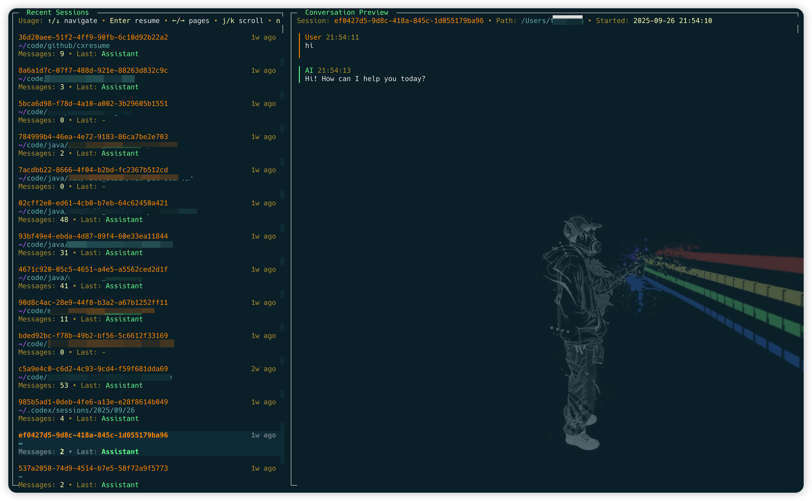

cxresume (Codex Resume CLI)
===========================
[](https://www.npmjs.com/package/cxresume)

[中文说明](./README-zh.md)



Codex Resume (cxresume) is a tiny CLI/TUI to resume Codex sessions fast. It discovers and loads conversation logs under `~/.codex/sessions`, and launches Codex using `codex resume <sessionId>` so you can pick up where you left off. Two primary entry points keep things simple:

- `cxresume` — browse every session from your Codex history
- `cxresume cwd` — focus on sessions whose recorded working directory lies in this workspace (recursively)

If you’re searching for “codex resume”, “resume codex sessions”, or “load sessions from history”, this tool was built for exactly that workflow.

Install

- Node.js 18+
- Codex CLI (codex) >= 0.46.0
- Global install (recommended): `npm i -g cxresume`
- Verify: `cxresume --help`
- Upgrade: `npm i -g cxresume@latest`
- Uninstall: `npm uninstall -g cxresume`

Tip: one‑off run without installing: `npx cxresume --help`

Quick Start

- `cxresume` — opens a split‑pane TUI. The top pane lists sessions; the bottom pane previews recent dialog. Press Enter to launch `codex resume <sessionId>` for the selected session.
- `cxresume cwd` — pins the view to the current workspace tree. The command filters sessions whose recorded `cwd` matches the current directory or any subdirectory.

Why cxresume

- Workspace-scoped session recovery with one command (`cxresume cwd`)
- Resume Codex sessions instantly from prior logs
- Filter and search sessions with familiar shell commands
- Uses Codex’s native `resume` command (no primer/injection needed)
- Works as an interactive TUI or non‑interactive CLI
- Zero project config; just point to your Codex logs

TUI Keys

- Navigation: `↑/↓` move selection; `←/→` change pages
- Preview: `j/k` scroll the bottom preview
- Start: `Enter` resume the selected session
- New session: `n` start a new Codex session in the same directory
- Delete session: `d` delete the selected session file (confirms via dialog; choose Yes/No with `Y/N` or `←/→`, `Enter` confirms selection; permanently removes the `.jsonl` file)
- Edit options: `-` append extra arguments to your `codexCmd` for this launch
- Copy ID: `c` copy the session identifier (from the file’s meta) to clipboard
- Full view: `f` toggle full preview
- Quit: `q` or `Esc`

Options

- `--list` — list recent session files
- `--open <file>` — open a specific session jsonl (relative to root or absolute)
- `--root <dir>` — override sessions root (default: `~/.codex/sessions`)
- `--codex <cmd>` — override Codex launch command (default: `codex`)
- `--search <text>` — content search across all sessions, then pick from matches
- `--legacy-ui` — legacy selector without the split preview
- `--preview` / `--no-preview` — enable/disable a short preview before launching
- `--print` — print the exact command that would run and exit
- `--no-launch` — do not launch Codex (useful with `--print`)
- `-y`, `--yes` — skip interactive pauses
- `-n`, `--new` (with `cwd`) — launch a fresh Codex session from this directory
- `-l`, `--latest` (with `cwd`) — resume the most recent session whose recorded `cwd` is inside this directory
- `-r`, `--recursive` (with `cwd`) — deprecated (recursion is always enabled)
- `-h`, `--help` — show help
- `-v`, `--version` — show version

Filters

- Dot filter: `cxresume .` shows only sessions whose recorded working directory exactly matches your current directory (best‑effort; depends on logs containing `cwd`).
- Workspace filter: `cxresume cwd` restricts to sessions whose recorded working directory is the current directory or any subdirectory (best‑effort; depends on logs containing `cwd`).

Workspace Sessions

Each session log stores the working directory from which it was created. `cxresume cwd` reuses that metadata to scope the picker to your current project tree—no additional bookkeeping files are required. Use `cxresume cwd -n` if you want to launch a brand new Codex session from the current directory, or `cxresume cwd -l` to resume the latest matching session immediately. Inside the TUI, press `n` to start a new Codex session with the same working directory as the highlighted entry.

Config

- Place JSON at `~/.config/cxresume/config.json`:

```
{
  "logsRoot": "/home/me/.codex/sessions",
  "codexCmd": "codex",
  "preview": false
}
```

How It Works

- Discovers `*.jsonl` logs under the sessions root.
- Parses each file; expects the first line to be `session_meta`. Messages are derived from `event_msg` of type `user_message` and `agent_message`.
- Extracts `sessionId` from the session file’s meta (first line `session_meta`).
- Launches `codex resume <sessionId>` (plus any extra args you provide in the TUI).

Also Known As

- codex resume
- resume codex sessions
- load sessions from history

Examples

- Pick interactively and start:
  - `cxresume`

- Filter to current directory:
  - `cxresume .`

- Search content first, then pick:
  - `cxresume --search build script`

- Open a specific file and start immediately:
  - `cxresume --open 2025/09/24/session.jsonl -y`

License

MIT
