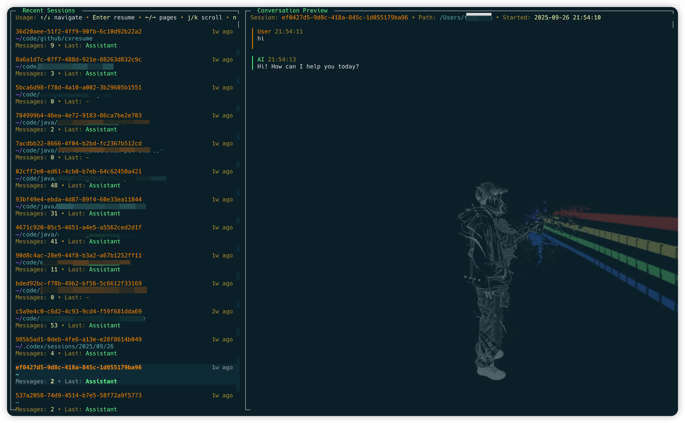

cxresume（Codex Resume CLI）
===========================
[](https://www.npmjs.com/package/cxresume)

[English](./README.md)



Codex Resume（cxresume）是一个用于“继续/恢复 Codex 会话”的命令行/TUI 小工具：从 `~/.codex/sessions` 加载历史记录，并使用 `codex resume <sessionId>` 启动 Codex 让你在原处继续。为了更方便的流程，我们提供两个主要入口：

- `cxresume` —— 浏览所有 Codex 历史会话
- `cxresume cwd` —— 只关注当前目录及子目录下记录的会话（基于日志中的 `cwd`）

如果你在搜索 “codex resume”、“resume codex sessions” 或 “load sessions from history”，这个工具正是为此场景而生。

安装

- Node.js 18+
- Codex CLI（`codex`）版本 >= 0.46.0
- 全局安装（推荐）：`npm i -g cxresume`
- 验证：`cxresume --help`
- 升级：`npm i -g cxresume@latest`
- 卸载：`npm uninstall -g cxresume`

提示：一次性运行可使用 `npx cxresume --help`

快速开始

- 运行 `cxresume` 打开分屏 TUI：上半区列出会话，下半区展示最近对话预览。按 Enter 后，直接运行 `codex resume <sessionId>` 启动 Codex 并恢复会话。
- 运行 `cxresume cwd` 聚焦当前工作目录及其子目录。该命令会根据日志中的 `cwd` 元数据筛选出与当前项目相关的会话。

为什么是 cxresume

- 一条命令实现工作区级会话恢复（`cxresume cwd`）
- 即刻从历史日志恢复 Codex 会话
- 易于筛选和搜索会话，配合常见命令行参数
- 直接使用 Codex 原生 `resume` 命令（不再需要 Primer/剪贴板注入）
- 支持交互式 TUI 与非交互 CLI
- 无需项目配置，只需指向 Codex 日志目录

按键说明

- 列表导航：`↑/↓` 选择；`←/→` 翻页
- 预览滚动：`j/k`
- 启动会话：`Enter`
- 新建会话：`n`（在该会话记录的目录中启动）
- 删除会话：`d` 删除选中的会话文件（带确认弹窗；可用 `Y/N` 或 `←/→` 选择，`Enter` 确认；会永久删除该 `.jsonl` 文件）
- 临时添加参数：`-`（为本次启动临时追加到 `codexCmd`）
- 复制会话 ID：`c`
- 切换全屏预览：`f`
- 退出：`q` 或 `Esc`

命令行选项

- `--list` — 列出最近的会话文件
- `--open <file>` — 打开具体的 jsonl 文件（相对根目录或绝对路径）
- `--root <dir>` — 覆盖会话根目录（默认 `~/.codex/sessions`）
- `--codex <cmd>` — 覆盖 Codex 启动命令（默认 `codex`）
- `--search <text>` — 全量搜索后选择
- `--legacy-ui` — 旧版单列选择器（无分屏预览）
- `--preview` / `--no-preview` — 启动前是否显示简短预览
- `--print` — 仅打印将要执行的命令并退出
- `--no-launch` — 不启动 Codex（通常配合 `--print` 使用）
- `-y`, `--yes` — 跳过交互确认
- `-n`, `--new`（配合 `cwd`）— 在当前目录下启动一个新的 Codex 会话
- `-l`, `--latest`（配合 `cwd`）— 直接恢复该目录及子目录中最近记录的会话
- `-r`, `--recursive`（配合 `cwd`）— 已废弃（递归筛选现在默认开启）
- `-h`, `--help` — 帮助
- `-v`, `--version` — 版本

筛选

- 当前目录筛选：`cxresume .` 仅显示日志中 `cwd` 等于当前目录的会话（尽力而为，依赖日志中是否记录 `cwd`）。
- 工作区筛选：`cxresume cwd` 会筛选日志中 `cwd` 位于当前目录或任意子目录的会话（同样依赖日志是否包含 `cwd`）。

工作区会话

会话日志会记录生成时的 `cwd`。`cxresume cwd` 直接利用这些元数据，把会话列表限定在当前目录及所有子目录，无需额外的记录文件。想要从当前目录开启新会话，可使用 `cxresume cwd -n`；想快速回到最近的匹配会话，使用 `cxresume cwd -l`。在分屏 TUI 中，也可以按 `n` 以高亮项的工作目录启动新的 Codex 会话。

配置

- 配置文件：`~/.config/cxresume/config.json`

```
{
  "logsRoot": "/home/me/.codex/sessions",
  "codexCmd": "codex",
  "preview": false
}
```

工作原理

- 从会话根目录发现 `*.jsonl` 日志。
- 解析文件：第一行期望是 `session_meta`；对话消息来自 `type=event_msg` 且 `payload.type ∈ { user_message, agent_message }`。
- 快速读取文件首行 `session_meta`，提取 `sessionId`。
- 以 `codex resume <sessionId>` 的方式启动（可附带在 TUI 中编辑的额外参数）。

也叫 / 关键词

- codex resume
- resume codex sessions
- load sessions from history

示例

- 交互选择并启动：
  - `cxresume`

- 仅显示当前目录的会话：
  - `cxresume .`

- 先搜索再选择：
  - `cxresume --search 构建脚本`

- 打开并直接启动：
  - `cxresume --open 2025/09/24/session.jsonl -y`

许可协议

MIT
